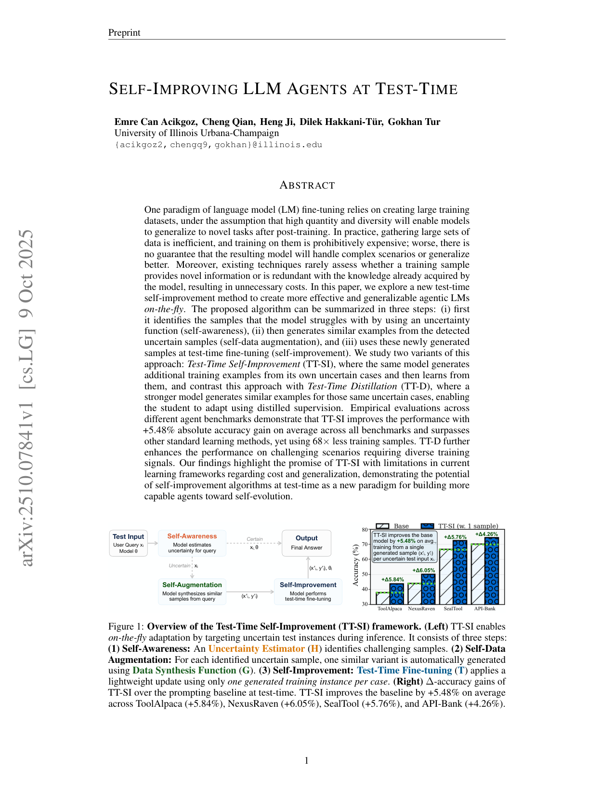
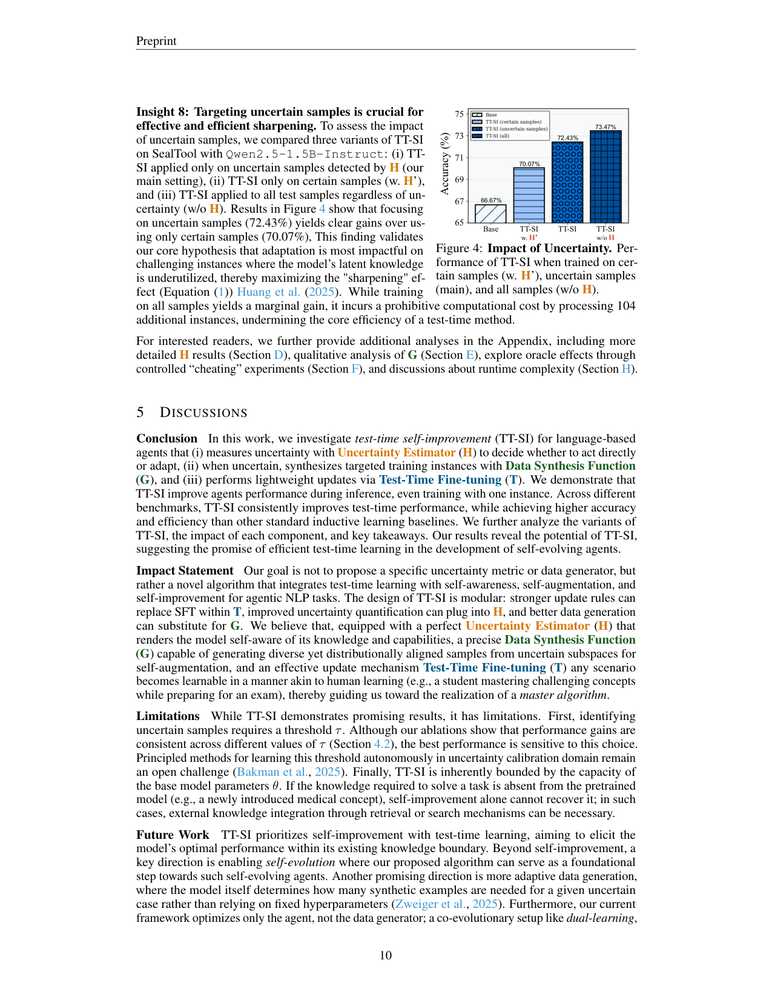

`tt_si | TT-SI: Self-Improving LLM Agents at Test-Time | UIUC(Emre Can Acikgoz, Cheng Qian, Heng Ji, Dilek Hakkani-Tür, Gokhan Tur) | Preprint;arXiv:2510.07841v1 [cs.LG] 2025-10-09 | 主题线 L?(test-time 自改进 / 测试期梯度微调)·相关性 High`

> deep 档笔记(由 light 升级:保留第一层/6轴/图/对标,补第二+三层)。基于已下载 PDF 正文(`resource/papers/tt_si.pdf`,29 页)与渲染图。三标注:【原文】/【推断】/【待核】。

══ 第一层:一眼看懂 ══
- 🟦 **TL;DR**:别再堆海量数据做 SFT(贵、还不保证泛化、很多样本是模型早会的冗余)。TT-SI 在**推理当下**针对每个测试样本即时自我进化,三步:(i) **自我觉察**——用不确定性函数挑出模型拿不准的测试输入;(ii) **自我数据增强**——让模型自己围绕这个不确定样本合成 1 个相似训练样本;(iii) **自我改进**——用 LoRA 对这个(单条)合成样本做临时梯度微调,再去答原题。对比变体 **TT-D** 用更强的教师模型来合成监督(蒸馏)。四个 agent/工具调用基准平均 **+5.48%**,而**用样本量比 SFT 少 68×**。【原文 Abstract/Fig1】
- **最巧的一步**:**用不确定性(自研 RSS 估计器,而非朴素 PPL)精准筛"该学的样本"**。抽掉它(改成在确定样本上训、或随机训),增益反而下降甚至变负(Fig4 显示在 certain 样本上训不升反降)——筛对"模型真不会的点"是整套即时微调有效且 68× 省样本的根。Fig5 论证 PPL 区分度差、RSS(最可能 vs 次可能函数调用之差)区分度好。【原文 §"Impact"/Fig4/Fig5】

══ 第二层:为什么做(写透,重点) ══
- **研究背景**:LM 后训主流范式=造大数据集,假设"高数量+高多样性→训完能泛化到新任务"。但作者指出这与人类学习相比"狭窄且低效":人类靠 self-regulated learning,**主动找出自己的知识缺口、针对性练习**(元认知反思),而非盲目刷各种题。【原文 §1】
- **解决的具体痛点**(归纳式微调的 4 个基础病,§2.1):① **分布漂移** \(P_{test}≠P_{train}\),训练经验风险误导真实测试风险;② **算力成本** \(N≫10⁴\) 的标注+训练成本随 N 线性涨,贵到 prohibitive;③ **冗余**——把所有 N 个样本当同等信息量低效,真正有效样本 \(N_{eff}≪N\),处理已掌握/冗余样本浪费算力甚至损泛化;④ **灾难性遗忘 + model churn**——SFT 新任务会退化旧技能,且每出新基模就要在 D_train 上重训一遍。最核心痛点:**现有微调几乎不评估"某样本是否提供新信息 vs 与模型已会的冗余"**。【原文 §2.1】
- **相关工作 & 各自不足**(三条线):
  · **test-time training(TTT)**:源于 local/transductive learning(Bottou&Vapnik'92);LLM 上 Hardt&Sun'24 在检索近邻上微调降 perplexity、SIFT 主动选多样近邻、Akyürek'25(ARC)对 in-context 例子做规则线性变换造 TTT 数据。**不足**:要么针对 perplexity 而非通用推理、要么**假设有高质量近邻/in-context 范例可用**。TT-SI 不依赖这些——**自己生成并筛训练信号**;
  · **LLM self-improvement**(STaR/self-debug/self-reward 等):靠模型内部信号 refine 自身输出分布。理论基础=**sharpening mechanism**(Huang'25):模型把输出分布迭代锐化到高置信、对齐内部自评的预测,**surfacing 隐藏在权重里的 latent knowledge**(非凭空造知识);
  · **agent 微调**(Agent-FLAN/CoALM 等):靠大规模 agent 数据 SFT——正是本文批判的贵+冗余范式。
  自我定位:**首个把"语言生成式 test-time fine-tuning"用到 LLM agent** 的工作。【原文 §2.2/§2.3/App C】
- **动机链**:现状=归纳式 SFT 贵、冗余、易遗忘、不分样本信息量 → 既然 self-improvement 本质是"锐化分布、surfacing latent knowledge"(Huang'25 理论),那**最该锐化的就是模型当前最不确定的点**(latent knowledge 最未被利用处)→ 所以:① 用不确定性估计器 H 只挑模型拿不准的测试样本(self-awareness),② 围绕它即时合成相似样本 G(self-augmentation),③ 用 LoRA 临时微调 T 再答原题、答完还原参数(self-improvement,per-instance)。为什么不用更简单的"全量 SFT"或"在确定样本上也训"?Fig4 直接证明在 certain 样本上训不如 uncertain,全量训只多 +1% 却要多处理 104 个样本(成本 prohibitive)→ 精准筛是效率与效果的根。【原文 §2.3/§3/§4.2】
- **与最近邻工作的 Δ**:① 与 **Akyürek'25(TTT for ARC)** 的 Δ:他们对已有 in-context 例子做规则线性变换得 TTT 数据(需有范例);TT-SI **用模型自己 language-generate 合成样本**,不需现成近邻/范例(Δ=从"变换已有例子"到"自合成新例子",且首次用于 agent)。② 与朴素 **self-improvement(全数据集 sharpening)** 的 Δ:TT-SI 把 sharpening **局部化到 per-instance + 只在不确定点**,\(θ^*_i\) 答完即丢——既锐化又不污染基模、不遗忘(Δ=全局持久 vs 局部临时)。③ 与 **SFT** 的 Δ:同样梯度学习,但 TT-SI 在测试分布的不确定子集上学、每点 1 条合成样本,68× 省样本还更准(Δ=归纳 vs 转导/局部)。【原文 §2.2/Insight2】

══ 第三层:怎么做 + 靠不靠谱 ══
- **方法流水线**(Alg.1,逐测试样本 x_i;输入基模 \(M+θ_0\) → 输出该样本预测 \(ŷ_i\),参数还原):
  1. **H 不确定性估计(self-awareness)**:对 x_i 的每个候选动作 a_n(如可用 API)算 \(NLL=−\log P_M(a_n|x_i)\),做 **RSS(Relative Softmax Scoring)** 归一化成置信分布 p_n,取**最高与次高之差** \(u(x_i)=p⁽¹⁾−p⁽²⁾\)(softmax-difference);\(u(x_i)<τ\) 判为不确定;
  2. **若确定** → 直接用 \(θ_0\) 推理(跳过学习,省成本);
  3. **若不确定 → G 数据合成(self-augmentation)**:用模型自己 L_gen + 手工 prompt P,以 x_i 为 seed(**不含其标签 y_i**)生成 K 个语义相似但有表面变化的 (x',y') 对,组成临时数据集 D_i;
  4. **T 测试期微调(self-improvement)**:用 **LoRA** 在 D_i 上最小化任务 loss 得临时参数 \(θ^*_i\);
  5. 用 \(θ^*_i\) 答原题 x_i 得 \(ŷ_i\),然后**还原 \(θ^*_i→θ_0\)**,处理下一样本。
  · **TT-D 变体**:把 G 的"自合成"换成更强教师(**gpt-5-mini**)合成监督=蒸馏;**TT-ICL 变体**:把合成样本塞 prompt 而非微调(免训练)。【原文 §3/Alg.1】
- **逐组件必要性 + 消融**:
  · **H 不确定性筛(self-awareness)**:核心。Fig4 三对照——uncertain(72.43%)> certain w.H'(70.07%)> 全量 w/o H(73.47% 但多处理 104 样本)。证明"在模型真不会的点上 sharpening 才最有效";全量虽略高但成本 prohibitive。【原文 §4.2 Fig4 Insight8】
  · **τ 阈值**:Table2 消融——\(τ=0.95\) 选 190/294 样本(65%)得 72.43%,接近全量 73.47% 但省 35% 更新;\(τ=0.35\) 漏检多(TPR=0.42)降到 68.10%。**所有 τ 都超基模 66.37%**,但最优值敏感(作者列为 limitation)。【原文 §4.2 Table2 Insight6】
  · **RSS vs 朴素 NLL/PPL**:作者论证原始 NLL 无界、不可直接比较,故用 RSS 归一化到可解释置信(§D 进一步给估计器准确率)。
  · **TT-SI vs TT-D(自合成 vs 教师蒸馏)**:Table1 显示 TT-D 在 direct/MV/pass@5 上比 TT-SI 再 +0.94%/+1.68%/+2.65%,在 multi-turn 等复杂场景增益更明显→更高质量监督有"温和但一致"的额外收益。
  · **数据/模型 scaling**:Fig2-right(OOD 用 xLAM 数据)TT-SI 在 1/2/4/8 scale 全超 SFT;Fig3 模型 scaling 1.5B(+5.76%)> 7B(+3.02%)→小模型相对增益更大。【原文 §4 Table1/Fig2/3】
- **关键机制直觉**:softmax-difference \(u=p⁽¹⁾−p⁽²⁾\) 的直觉——若模型对"最可能动作"和"次可能动作"给的归一化置信几乎一样大(差小),说明它在两个函数调用间犹豫=不确定;差大则笃定。**只在差小处介入**。sharpening 的直觉:\(θ^*_i\) 在围绕 x_i 的合成样本上微调,把模型对"该类查询的正确输出格式/推理"的概率质量拉高(eq.1 的 r_self),等于"逼模型把本来会但没自信表达出来的隐藏知识显化"——所以从单条样本就能涨,因为不是教新知识、是锐化已有分布。【原文 §2.3/§4.1】
- **实验与证据**:4 个 agent/工具调用基准 **NexusRaven / SealTool / API-Bank(多轮对话) / ToolAlpaca**,基模 **Qwen2.5-1.5B-Instruct**(+7B ablation),全用 LoRA、单 A40 GPU,每实验跑 5 次取均值(小样本方差大)。核心证据:① Table1——direct inference 平均 54.66→60.14(+5.48%),majority-vote +3.85%,pass@5 +3.46%;TT-D 进一步 +6.42%/+5.53%/+6.11%;② Insight2/Fig2-left——SealTool 上 TT-SI(72.43%)超标准归纳 SFT(70.20%)2.23%,**只用 190 个不确定样本×1 合成 ≈ 比 13k 全量训练集少 68×**;③ TT-ICL(免训练)也超用了官方训练集的标准 ICL。**baseline 公平性**:同基模、同基准、5 seed 平均、给出标准差;SFT 用官方 13k split 或 SOTA xLAM 数据做 OOD——对比设置较公平。**"看着强但没回答核心问题"的风险**:数据集都是**工具调用/函数选择**,动作空间相对小且离散(候选 API 有限),RSS 的"候选动作置信差"在这类任务天然好算;**能否迁移到开放式生成/长链推理(候选动作不离散)是未验证的**(作者 future work 也才提 math)。【原文 §4/Table1/2/Fig2/3/4】
- **假设与失效边界**:【原文】Limitations 明说:① τ 阈值最优值敏感(自主校准是 open problem);② **TT-SI 被基模容量上界框死**——若解题所需知识根本不在预训练模型里(如新医学概念),self-improvement 救不回来,需外部检索/搜索。【推断】③ 隐式假设"模型能自合成出**同分布且正确**的样本"——**无验证器保证合成正确性**(若 G 生成错样本/标签,\(θ^*_i\) 会学错);④ 不确定性估计依赖"候选动作离散可枚举"(工具调用成立,开放生成存疑);⑤ per-instance 微调有非平凡推理延迟(Table4/§H runtime),规模化部署受限。
- **祛魅总结**:【推断】**真贡献(硬货)**:把 self-improvement 的 sharpening 理论**落到一个干净、可操作的 per-instance test-time 算法**(H→G→T 三段模块化),并用扎实消融(Fig4 筛样本必要性、Table2 τ、Fig2/3 双 scaling、5-seed)证明"只在不确定点上、每点 1 条自合成样本"就能 68× 省样本超 SFT——对"小模型+按需微调"路线是有说服力的样板。RSS 估计器是个简单好用的小积木。**包装/可质疑**:① "self-evolution 新范式"是 framing(作者自己也澄清 Impact 段:目标不是提出具体 metric/generator 而是这个集成算法,且承认被基模容量框死、不创造新知识)——本质是**局部分布锐化**,别当成"持续进化";② 缺合成正确性验证器是真硬伤(作者也承认);③ 所有主结果集中在工具调用(离散动作)任务,泛化性待证;④ **无开源代码仓**(只给 Algorithm 1 伪码),复现需自行实现。整体诚实度较高(Limitations 写得实在),但"toward self-evolution"的标题略有过度承诺之嫌。

🎯 **机制速览 6 轴** [light]
| 维度 | 内容 |
|---|---|
| **学什么信号** | **模型自身的不确定性**(RSS:候选动作 softmax 置信差)→ 触发;监督来自 **自合成样本(TT-SI)** 或 **教师合成样本(TT-D,蒸馏)**【原文 §"Method"/Alg.】 |
| **改什么** | **参数**(LoRA/PEFT 临时更新 \(θ^*_i\));训练后该临时权重可丢弃(per-instance)【原文 Alg. line 12-13】 |
| **何时改** | **test-time / per-instance(在线、逐不确定样本)**——边推理边微调;另提供 TT-ICL 免训练变体(训练不可行时)【原文 Abstract/§】 |
| **免梯度?** | **否(含梯度)**——核心 TT-SI/TT-D 走 LoRA 梯度微调;TT-ICL 变体才免梯度【原文】 |
| **记忆-技能生命周期** | 无持久记忆库;每个不确定样本→合成 1 条→临时学→(可)丢弃 θ*;不跨样本累积技能(原文未提持久积累/淘汰)【原文/待核】 |
| **防遗忘机制** | **临时/隔离式更新**(per-instance LoRA,推理完可还原,天然不污染基模);**无显式持续学习抗遗忘组件**;延迟分析见 Table4【原文/推断】 |

🖼 **关键图 top-2** [light]

这是**原文 Figure 1**:左=三步流水线(自我觉察 H → 自我数据增强 G → 测试期微调 T);右=四基准上对 prompting 基线的 Δ 增益(ToolAlpaca +5.84/NexusRaven +6.05/SealTool +5.76/API-Bank +4.26)。选它因为一图讲清整套"边推边自我进化"的机制与收益。【原文图1】

这是**原文 Figure 4**(SealTool):在 **certain 样本(w. H′)/uncertain 样本(main)/全部样本** 三种来源上训练的对比——**只在不确定样本上训才有效**,印证"自我觉察"是 sharpening 的关键。选它因为它直接证明论文最巧那一步(筛对样本)不可抽掉。【原文图4】(该图位于页面右上,本 light 档渲染整页;同页含 Conclusion/Limitations,可一并参考)

══ 假设与失效边界(一句)══
- 【推断】核心假设是"不确定性估计器能可靠定位模型真正的能力缺口、且模型有能力自合成出'同分布且正确'的训练样本";作者自述 **TT-SI 对阈值 τ 敏感**(Limitations),且当自合成样本错误/不确定性误判时,临时微调会学错——依据:§Limitations 明言"sensitive to thresholding"且自合成正确性无验证器保证。

🎯 **对"探索-巩固"idea 对标**(一句)[light]
- **可借组件 + 部分竞品**:TT-SI 是"per-instance test-time 巩固(梯度)"的代表,与本项目"巩固进参数"同向;其 **不确定性触发(只在模型不会的点才学)** 与 **自/教师双路合成监督(TT-SI vs TT-D 蒸馏对照)** 高度契合本项目"教师脚手架蒸馏 + 在关键/低置信处接管"的思路——RSS 不确定性可作"何处需要教师介入/path-recovery"的触发信号,是直接可迁移的积木;但其"临时丢弃权重、不跨样本积累"与本项目"沉淀进参数"取舍相反,可作对照。

⑦ **开源代码 + 框架**:**论文正文未给出本方法的开源代码仓**(仅引用所用数据/基模链接:stanford_alpaca 数据集、HF 上 Qwen2.5-1.5B-Instruct)——【原文未提供代码链接,标"未找到开源代码链接"】〔待核:可后续查作者主页/arXiv 是否补充〕。**训练框架:LLaMA-Factory**(原文明示用于 test-time fine-tuning,"chosen for its optimized implementation");PEFT/**LoRA** 做微调;推理用 AutoModelForCausalLM(置信度估计阶段不用 vLLM 以取概率)。
💰 资源/成本:主实验基模 **Qwen2.5-1.5B-Instruct**(另有 Qwen2.5-7B 规模实验,Fig3);**每个不确定测试样本仅 1 条合成样本**、相对 SFT 省 68× 样本;Table4 给出 step-wise 延迟分解(合成+微调+合并的开销)——即时微调有非平凡推理延迟代价【原文 Table4】。
🔭 开放问题:【原文】更优不确定性估计器、精准数据合成、把 test-time self-improvement 当持续/终身学习的基石(Future Work 提到 self-evolution 与 co-evolution 方向);【推断】缺自合成正确性的验证器是硬伤,阈值敏感与逐样本延迟限制规模化部署。
